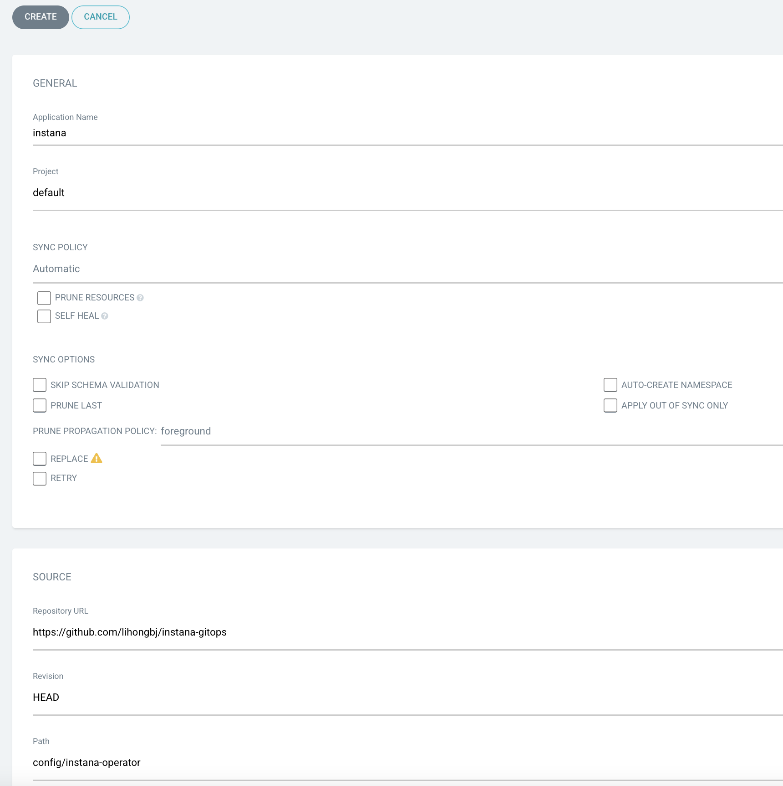
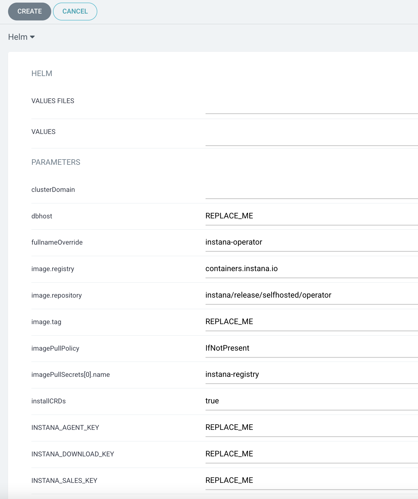
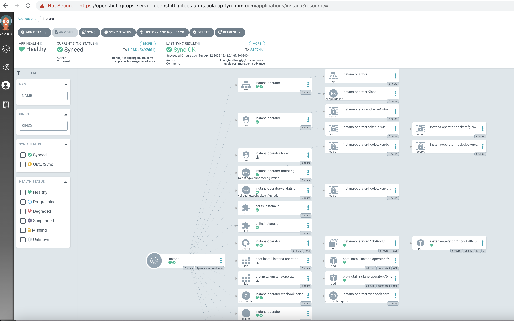
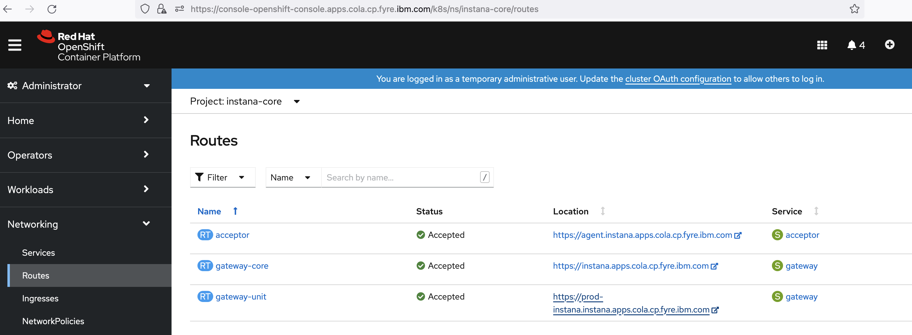

<!-- START doctoc generated TOC please keep comment here to allow auto update -->
<!-- DON'T EDIT THIS SECTION, INSTEAD RE-RUN doctoc TO UPDATE -->
**Table of Contents**  *generated with [DocToc](https://github.com/thlorenz/doctoc)*

- [Deploy Instana with OpenShift GitOps](#deploy-instana-with-openshift-gitops)
  - [Prerequisites](#prerequisites)
    - [Deploy Instana to Kubernetes Cluster](#deploy-instana-to-kubernetes-cluster)
    - [Deploy Instana to OpenShift Cluster](#deploy-instana-to-openshift-cluster)
  - [Install Infra (Crossplane and Crossplane Instana Provider)](#install-infra-crossplane-and-crossplane-instana-provider)
    - [Login to Argo CD](#login-to-argo-cd)
  - [Login to OpenShift and grant Argo CD enough permissions](#login-to-openshift-and-grant-argo-cd-enough-permissions)
    - [Install Crossplane Instana Provider](#install-crossplane-instana-provider)
    - [Verify Crossplane Provider](#verify-crossplane-provider)
      - [CLI Verify](#cli-verify)
      - [UI Verify](#ui-verify)
  - [Deploy Instana](#deploy-instana)
    - [Create secret for target k8s kubeconfig](#create-secret-for-target-k8s-kubeconfig)
    - [Create configmap for Instana settings](#create-configmap-for-instana-settings)
    - [Create Argo CD application for installing Instana](#create-argo-cd-application-for-installing-instana)
  - [Verify Instana Installation](#verify-instana-installation)
      - [CLI Verify](#cli-verify-1)
      - [UI Verify](#ui-verify-1)
  - [Access Instana UI](#access-instana-ui)

<!-- END doctoc generated TOC please keep comment here to allow auto update -->

# Deploy Instana with OpenShift GitOps

## Prerequisites

- OpenShift 4.6+ :  With at least 16 Core, 64G Memory and 250G Disk

- Gitops Operator (Red Hat OpenShift GitOps) in OpenShift operator-hub

- bastion VM that has login OCP cluster and binary instana kubectl plugin ready to download license 

- Instana DB Host
  - With at least 16 Core, 64G Memory and 250G Disk
  - All DB container are ready and running on the DB Host

- storageClass has installed

- [Argo CD](https://argo-cd.readthedocs.io/en/stable/getting_started/#6-create-an-application-from-a-git-repository) was deployed in the OCP Cluster

- Login to OpenShift and apply below yaml to grant Argo CD  permissions on bastion:

  ```yaml
  kind: ClusterRoleBinding
  apiVersion: rbac.authorization.k8s.io/v1
  metadata:
    name: argocd-admin
  subjects:
  - kind: ServiceAccount
    name: openshift-gitops-argocd-application-controller
    namespace: openshift-gitops
  roleRef:
    apiGroup: rbac.authorization.k8s.io
    kind: ClusterRole
    name: cluster-admin
  ```

  

  

## Deploy Instana to OpenShift Cluster
### Login to Argo CD

Login with `admin` as Username and below Password: 

```sh
export ARGO_PASSWORD=$(oc get secret openshift-gitops-cluster -n openshift-gitops -o "jsonpath={.data['admin\.password']}" | base64 -d)
```


### Deploy Instana

#### Prepare install

Download and run below on bastion:

```sh
wget  https://github.com/IBM/instana-gitops/blob/main/config/instana-operator/scripts/prepare.sh | sh
```


#### Create Instana application to install

Input parameters as follows when creating application:
- GENERAL
  - Application Name: instana
  - Project: default
  - SYNC POLICY: Automatic
- SOURCE
  - REPO URL : https://github.com/IBM/instana-gitops
  - Target version: HEAD
  - path: config/instana-operator
- DESTINATION
  - Cluster URL: https://kubernetes.default.svc
  - Namespace: instana-operator
- HELM:  fill below and   `REPLACE_ME` parameters
  - image.tag
  - dbhost
  - storageClassName
  - INSTANA_DOWNLOAD_KEY
  - ...








## Verify Instana Installation

#### ArgoCD UI Verify

From Argo CD UI, you will see the `instana` application growing and creating:




#### CLI Verify

After instana application is created in ArgoCD UI, you can go to bastion VM terminal to wait instana core and unit to finish creating, and this will take about 1 hour.

You can check progress of instana by :

```sh
oc get event -n instana-core
oc get event -n instana-units
```

After instana instance was deployed and all pods are running, you can run the command as follows to check:

```sh
kubectl get application -A
kubectl get core -A
kubectl get unit -A
kubectl get po -n instana-operator
kubectl get po -n instana-core
kubectl get po -n instana-units
```

In this tutorial, the output of the above command is as follows:


```console
# kubectl get application -A
NAMESPACE          NAME      SYNC STATUS   HEALTH STATUS
openshift-gitops   instana   Synced        Healthy

# kubectl get core -A
NAMESPACE      NAME           STATUS   VERSION
instana-core   instana-core   Ready    215-4

# kubectl get unit -A
NAMESPACE       NAME           STATUS   VERSION
instana-units   instana-prod   Ready    215-4
```

Wait a while and check if all pods under namespace `instana-operator`, `instana-core` and `instana-units` and are running well without any crash.

```console
# kubectl get po -n instana-operator
NAME                                  READY   STATUS      RESTARTS   AGE
instana-operator-f4bbd6bd8-46m68      1/1     Running     1          6h19m
post-install-instana-operator-t9pjq   0/1     Completed   0          6h19m
pre-install-instana-operator-75hls    0/1     Completed   0          6h20m
```
```console
# kubectl get po -n instana-core
NAME                                        READY   STATUS    RESTARTS   AGE
acceptor-5b6f9dccc-cbnp6                    1/1     Running   0          5h46m
accountant-86cb54d47c-wqxtm                 1/1     Running   0          5h46m
appdata-health-processor-77cd54bc94-f6drb   1/1     Running   0          5h46m
appdata-live-aggregator-7b6f46fb77-6p952    1/1     Running   0          5h46m
appdata-reader-6ff9477587-57h2z             1/1     Running   0          5h46m
appdata-writer-67b864d86d-vhmmf             1/1     Running   0          5h46m
butler-74b9648fc9-sg2n6                     1/1     Running   0          5h46m
cashier-ingest-9f657fbdd-pplvz              1/1     Running   0          5h46m
cashier-rollup-5c597cc7b6-t92n9             1/1     Running   0          5h46m
eum-acceptor-59b8c5745c-nwflr               1/1     Running   0          5h46m
eum-health-processor-b9559db76-596k2        1/1     Running   0          5h46m
eum-processor-84774df7d7-dn6mx              1/1     Running   0          5h46m
gateway-76fcd8c9f6-q5v9h                    1/1     Running   0          5h23m
groundskeeper-74bd6b5f44-9pq75              1/1     Running   0          5h46m
js-stack-trace-translator-dc47bb957-fmrbm   1/1     Running   0          5h46m
serverless-acceptor-66484bdf98-lw4bm        1/1     Running   0          5h46m
sli-evaluator-6b879f566-nsgvd               1/1     Running   0          5h46m
ui-client-5bb686755d-mc67h                  1/1     Running   0          5h23m
```
```console
# kubectl get po -n instana-units
NAME                                                        READY   STATUS    RESTARTS   AGE
tu-instana-prod-appdata-legacy-converter-5cd45dd4bc-trfrl   1/1     Running   0          5h26m
tu-instana-prod-appdata-processor-d6f9c788d-c6zk9           1/1     Running   0          5h26m
tu-instana-prod-filler-6fdb5944bd-grgpq                     1/1     Running   0          5h26m
tu-instana-prod-issue-tracker-646b57bfcf-zqbtg              1/1     Running   0          5h26m
tu-instana-prod-processor-56d64bcbcf-kkbsd                  1/1     Running   0          5h26m
tu-instana-prod-ui-backend-65dbfd8969-nb5p4                 1/1     Running   0          5h26m
```


## Access Instana UI

In OCP portal, go to routes, and click `gateway-unit` to navigate to instana portal:




In login UI,

- `User name` is `admin@instana.local` by default
- `Passowrd` is set in ArgoCD application `portalPassword`,  default is `passw0rd` .

After click `Sign In`, you will be navigated to the Instan UI as follows.

