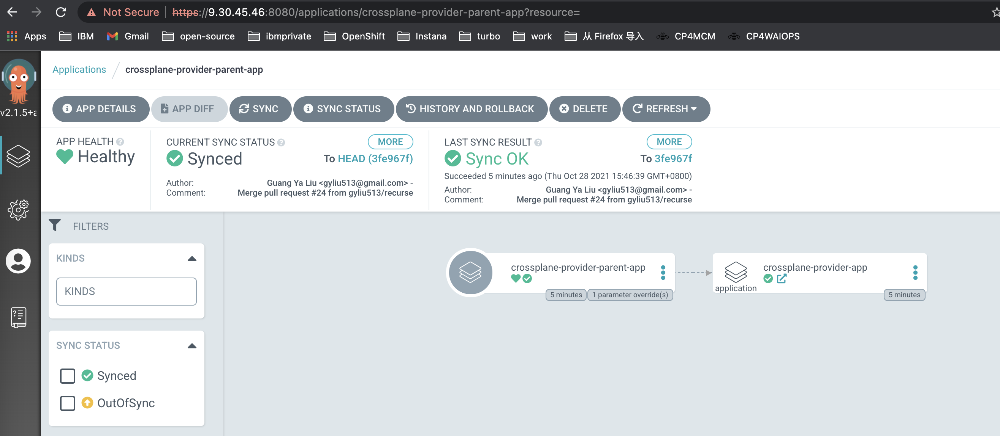

<!-- START doctoc generated TOC please keep comment here to allow auto update -->
<!-- DON'T EDIT THIS SECTION, INSTEAD RE-RUN doctoc TO UPDATE -->
**Table of Contents**  *generated with [DocToc](https://github.com/thlorenz/doctoc)*

- [Deploy Instana with Kubernetes GitOps](#deploy-instana-with-kubernetes-gitops)
  - [Prerequisites](#prerequisites)
    - [Deploy Instana to Kubernetes Cluster](#deploy-instana-to-kubernetes-cluster)
    - [Deploy Instana to OpenShift Cluster](#deploy-instana-to-openshift-cluster)
  - [Install Infra (Crossplane and Crossplane Instana Provider)](#install-infra-crossplane-and-crossplane-instana-provider)
    - [Create Application to Install Infra](#create-application-to-install-infra)
    - [Verify Infra](#verify-infra)
      - [CLI Verify](#cli-verify)
      - [UI Verify](#ui-verify)
  - [Deploy Instana](#deploy-instana)
    - [Create secret for target k8s kubeconfig](#create-secret-for-target-k8s-kubeconfig)
    - [Create configmap for Instana settings](#create-configmap-for-instana-settings)
    - [Create Argo CD application for installing Instana](#create-argo-cd-application-for-installing-instana)
  - [Verify Instana Installation](#verify-instana-installation)
    - [CLI Verify](#cli-verify-1)
    - [UI Verify](#ui-verify-1)
  - [Access Instana UI](#access-instana-ui)
    - [Setup Apache](#setup-apache)
    - [Access UI](#access-ui)

<!-- END doctoc generated TOC please keep comment here to allow auto update -->

# Deploy Instana with Kubernetes GitOps

This is a tutorial for how to deploy Instana with Kubernetes GitOps.

## Prerequisites

- Kubernetes Cluster for KIND
- Instana DB Host
  - With at least 16 Core, 64G Memory and 250G Disk
  - All DB container are ready and running on the DB Host
- [Argo CD](https://argo-cd.readthedocs.io/en/stable/getting_started/#6-create-an-application-from-a-git-repository) was deployed in the Kubernetes Cluster
### Deploy Instana to Kubernetes Cluster

- Kubernetes Cluster
  - With at least 16 Core, 64G Memory and 250G Disk

### Deploy Instana to OpenShift Cluster

- OpenShift 4.6+
  - With at least 16 Core, 64G Memory and 250G Disk

**NOTE:** If you do not have such Kubernetes Cluster, please refer to [GitOps Quick Start with Kubernetes KIND Cluster](https://github.com/cloud-pak-gitops/community/blob/main/gitops-quick-start-with-kind.md#gitops-quick-start-with-kubernetes-kind-cluster) for settting up Argo CD with a Kubernetes KIND Cluster.

In this tutorial, Argo CD was deployed in `argocd` namespace and Crossplane was deployed in `crossplane-system` namespace.

```console
root@gyliu-dev21:~# kubectl get po -n argocd
NAME                                 READY   STATUS    RESTARTS   AGE
argocd-application-controller-0      1/1     Running   0          5d20h
argocd-dex-server-5fc596bcdd-l6prz   1/1     Running   0          5d20h
argocd-redis-5b6967fdfc-l4r4k        1/1     Running   0          5d20h
argocd-repo-server-98598b6c7-v6rmj   1/1     Running   0          5d20h
argocd-server-5b4b7b868b-sxkgl       1/1     Running   0          5d20h
```

## Install Infra (Crossplane and Crossplane Instana Provider)

### Create Application to Install Infra

- Create application
- Choose `New App` in `Applications`
- Input parameters as follows, then `create`
  - GENERAL
    - Application Name: crossplane-provider-parent-app
    - Project: default
    - SYNC POLICY: Automatic
  - SOURCE
    - REPO URL: https://github.com/cloud-pak-gitops/instana-gitops
    - Revision: HEAD
    - Path: config/argocd-apps/infra
  - DESTINATION
    - Cluster URL: https://kubernetes.default.svc
    - Namespace: argocd
  - HELM
    - metadata.argocd_app_namespace: argocd
    - metadata.instana_provider_namespace: crossplane-system
    - repoURL: https://github.com/cloud-pak-gitops/instana-gitops

### Verify Infra

#### CLI Verify

After instana provider was deployed, you can run the command as follows to check:

```
kubectl get po -n crossplane-system
kubectl get application -A
argocd app list
```

In this tutorial, the output of the above command is as follows:

```console
root@gyliu-dev21:~# kubectl get po -n crossplane-system
NAME                                           READY   STATUS      RESTARTS   AGE
crossplane-6584bb9489-7lf7x                    1/1     Running     0          5m23s
crossplane-provider-instana-6c578cd958-6fqlq   1/1     Running     0          3m28s
crossplane-rbac-manager-856c9bb5df-vp95m       1/1     Running     0          5m23s
scc-instana-job-fm42r                          0/1     Completed   0          3m24s
```
```console
root@gyliu-dev21:~# kubectl get application -A
NAMESPACE   NAME                             SYNC STATUS   HEALTH STATUS
argocd      crossplane-provider-app          Synced        Healthy
argocd      crossplane-provider-parent-app   Synced        Healthy
```
```console
root@gyliu-dev21:~# argocd app list
NAME                            CLUSTER                         NAMESPACE          PROJECT  STATUS  HEALTH   SYNCPOLICY  CONDITIONS  REPO                                                PATH                           TARGET
crossplane-provider-app         https://kubernetes.default.svc  crossplane-system  default  Synced  Healthy  Auto-Prune  <none>      https://github.com/cloud-pak-gitops/instana-gitops  config/crossplane
crossplane-provider-parent-app  https://kubernetes.default.svc  argocd             default  Synced  Healthy  Auto        <none>      https://github.com/cloud-pak-gitops/instana-gitops  config/argocd-apps/crossplane  HEAD
```

You can see Instana provider was running, and there is also a job pod named as `scc-instana-job-fm42r` which was used to detect if Instana was going to be deployed in Kubernetes or OpenShift Cluster.

#### UI Verify

From Argo CD UI, you will be able to see there are two applications as follows:

- There are two applications, one is `crossplane-provider-parent-app` and another is `crossplane-provider-app`. The `crossplane-provider-parent-app` bring up the `crossplane-provider-app` via the [app-of-apps pattern](https://argo-cd.readthedocs.io/en/stable/operator-manual/cluster-bootstrapping/#app-of-apps-pattern).


- This is the deatail of app `crossplane-provider-parent-app`, and the following picture describes the [app-of-apps pattern](https://argo-cd.readthedocs.io/en/stable/operator-manual/cluster-bootstrapping/#app-of-apps-pattern).



- The following picture is the detail of the `crossplane-provider-app`, you can see all of the resources for this app.


## Deploy Instana

### Create secret for target k8s kubeconfig

Using the `kubeconfig` in this repo as example:

```shell
kubectl create secret generic k8s-kubeconfig --from-file=credentials=<kubeconfig> -n crossplane-system
```

**Note:** please replace the `kubeconfig` to your real file , default value: /root/.kube/config

### Create configmap for Instana settings

```shell
kubectl create configmap instana-settings --from-file=<settings.hcl> -n crossplane-system
```

**Note:** please replace the `settings.hcl` to your real file address

### Create Argo CD application for installing Instana

Input parameters as follows when creating application:
- GENERAL
  - Application Name: instana-parent-app
  - Project: default
  - SYNC POLICY: Automatic
- SOURCE
  - REPO URL: https://github.com/cloud-pak-gitops/instana-gitops
  - Target version: HEAD
  - path: config/instana
- DESTINATION
  - Cluster URL: https://kubernetes.default.svc
  - Namespace: argocd
- HELM
  - Update based on your cluster configuration

## Verify Instana Installation

### CLI Verify

After instana instance was deployed, you can run the command as follows to check:

```
kubectl get po -n crossplane-system
kubectl get application -A
kubectl get po -n instana-operator
kubectl get po -n instana-core
kubectl get po -n instana-units
```

In this tutorial, the output of the above command is as follows:

```console
# kubectl get po -n crossplane-system
NAME                                           READY   STATUS      RESTARTS   AGE
crossplane-6584bb9489-7lf7x                    1/1     Running     0          5m23s
crossplane-provider-instana-6c578cd958-6fqlq   1/1     Running     0          3m28s
crossplane-rbac-manager-856c9bb5df-vp95m       1/1     Running     0          5m23s
scc-instana-job-fm42r                          0/1     Completed   0          3m24s
add-instana-route-xfmnx                        0/1     Completed   0          10m24s
instana-k8s-kubeconfig-l28qr                   0/1     Completed   0          10m24s
```
```console
# kubectl get application -A
NAMESPACE   NAME                             SYNC STATUS   HEALTH STATUS
argocd      crossplane-provider-app          Synced        Healthy
argocd      crossplane-provider-parent-app   Synced        Healthy
argocd      instana-instance-app             Synced        Healthy
argocd      instana-parent-app               Synced        Healthy
```

Wait a while and check if all pods under namespace `instana-operator`, `instana-core` and `instana-units` and are running well without any crash.

```console
# kubectl get po -n instana-operator
NAME                                           READY   STATUS    RESTARTS   AGE
instana-selfhosted-operator-54f6b5f8c5-25zts   1/1     Running   0          4h39m
```
```console
# kubectl get po -n instana-core
NAME                                         READY   STATUS    RESTARTS   AGE
acceptor-5474cc68d8-fvcx8                    1/1     Running   0          4h38m
accountant-6dcd9fc89c-54cn2                  1/1     Running   0          4h38m
appdata-health-processor-6868cc58f9-zmfwn    1/1     Running   0          4h37m
appdata-live-aggregator-54d994b46c-zg4bx     1/1     Running   0          4h37m
appdata-reader-785b474687-2pwhv              1/1     Running   0          4h37m
appdata-writer-548dd5bd5-62lbj               1/1     Running   0          4h37m
butler-d6c684d64-jk6rt                       1/1     Running   0          4h38m
cashier-ingest-85ffb4f7c6-lv8pk              1/1     Running   0          4h38m
cashier-rollup-567fcfb45d-jbh2p              1/1     Running   0          4h38m
eum-acceptor-5ff44fdb7f-q6lzf                1/1     Running   0          4h37m
eum-health-processor-6965ff44c6-n6ssf        1/1     Running   0          4h37m
eum-processor-55ddffc8d7-29fxp               1/1     Running   0          4h37m
groundskeeper-5ccf6d59c9-57m8t               1/1     Running   0          4h38m
ingress-core-7bd794cfdd-br7fs                1/1     Running   0          4h37m
js-stack-trace-translator-785f4987dd-28k8n   1/1     Running   0          4h37m
serverless-acceptor-5db4c69f6f-r7s7j         1/1     Running   0          4h37m
sli-evaluator-5fdd6d6b78-qb97c               1/1     Running   0          4h37m
```
```console
# kubectl get po -n instana-units
NAME                                                        READY   STATUS    RESTARTS   AGE
ingress-6ff5647748-slrfj                                    1/1     Running   0          4h26m
tu-instana-prod-appdata-legacy-converter-5cb6d576b4-626th   1/1     Running   0          4h26m
tu-instana-prod-appdata-processor-7f7d6f65f-j2qnl           1/1     Running   0          4h26m
tu-instana-prod-filler-f5f579985-j8sss                      1/1     Running   0          4h26m
tu-instana-prod-issue-tracker-56d77fc6d4-6m8v7              1/1     Running   0          4h26m
tu-instana-prod-processor-54b7dc89f5-kqdrc                  1/1     Running   0          4h26m
tu-instana-prod-ui-backend-65d5c945c4-x8bkz                 1/1     Running   0          4h26m
ui-client-75dddbff9b-9njcm                                  1/1     Running   0          4h26m
```

### UI Verify

From Argo CD UI, you will be able to see there are another two applications added as follows:

- There are two applications, one is `instana-parent-app` and another is `instana-instance-app`. The `instana-parent-app` bring up the `instana-instance-app` via the [app-of-apps pattern](https://argo-cd.readthedocs.io/en/stable/operator-manual/cluster-bootstrapping/#app-of-apps-pattern).


- This is the deatail of app `instana-parent-app`, and the following picture describes the [app-of-apps pattern](https://argo-cd.readthedocs.io/en/stable/operator-manual/cluster-bootstrapping/#app-of-apps-pattern).


- The following picture is the detail of the `instana-instance-app`, you can see all of the resources for this app.


## Access Instana UI

### Setup Apache

You need a proxy sitting in front of k8s cluster and forward incoming traffic to Instana inside cluster via the nodeports. Here we use Apache as an example.

Install apache2:

```
apt-get update
apt-get install apache2
```

Create SSL certificates

```
openssl req -x509 -newkey rsa:2048 -keyout tls.key -out tls.crt -days 365 -nodes -subj "/CN=<hostname>"
```

Add below configuration file to `/etc/apache2/sites-available/instana-ssl.conf`:

```
<IfModule mod_ssl.c>
	<VirtualHost *:443>
		ServerName prod-instana.${INSTANA_HOST}
		SSLEngine on
		SSLProxyEngine On
		ProxyRequests Off
		SSLProxyCheckPeerName off
		ProxyPreserveHost On
		SSLCertificateFile path/to/tls.crt
		SSLCertificateKeyFile path/to/tls.key
		ProxyPass / https://prod-instana.${INSTANA_HOST}:30955/
		ProxyPassReverse / https://prod-instana.${INSTANA_HOST}:30955/
	</VirtualHost>

	<VirtualHost *:443>
		ServerName @@INSTANA_HOST
		SSLEngine on
		SSLProxyEngine On
		ProxyRequests Off
		SSLProxyCheckPeerName off
		ProxyPreserveHost On
		SSLCertificateFile path/to/tls.crt
		SSLCertificateKeyFile path/to/tls.key
		ProxyPass / https://${INSTANA_HOST}:30953/
		ProxyPassReverse / https://${INSTANA_HOST}:30953/
	</VirtualHost>
</IfModule>
```

Note:

- INSTANA_HOST is the hostname that hosts your K8S cluster.
- path/to/tls.crt and path/to/tls.key is the certificate that you created above.

Then run below commands to enable the configuration:

```console
# enable the site configuration for Instana
a2ensite instana-ssl

# enable the apache modules needed
a2enmod proxy
a2enmod proxy_http
a2enmod ssl

# restart apache service
service apache2 restart
```

### Access UI

Now you should be able to access Instana UI. Login to the Instan UI via `https://<Your Host>:443`.

- `User name` is `admin@instana.local` by default
- `Passowrd` is `<settings.hcl-admin_password>`, here `password` is `passw0rd` for my cluster.


After click `Sign In`, you will be navigated to the Instan UI as follows.


