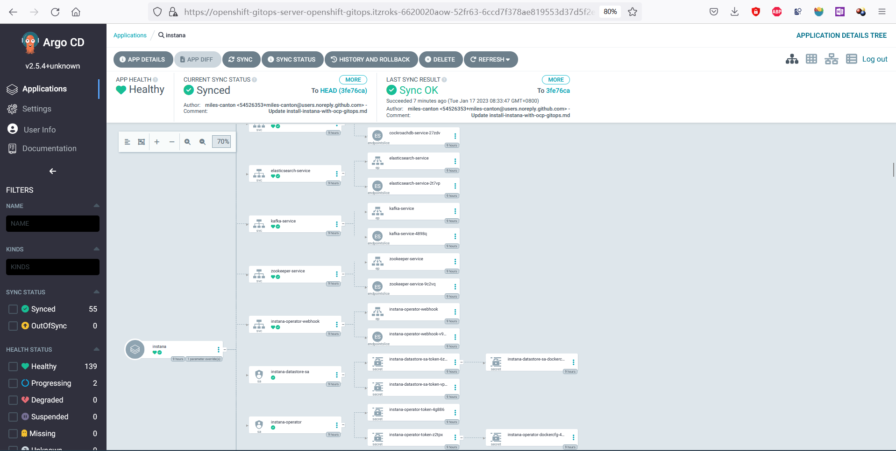

<!-- START doctoc generated TOC please keep comment here to allow auto update -->
<!-- DON'T EDIT THIS SECTION, INSTEAD RE-RUN doctoc TO UPDATE -->
**Table of Contents**  *generated with [DocToc](https://github.com/thlorenz/doctoc)*

- [Deploy Instana with OpenShift GitOps](#deploy-instana-with-openshift-gitops)
  - [Prerequisites](#prerequisites)
    - [Deploy Instana to Kubernetes Cluster](#deploy-instana-to-kubernetes-cluster)
    - [Deploy Instana to OpenShift Cluster](#deploy-instana-to-openshift-cluster)
    - [Login to Argo CD](#login-to-argo-cd)
  - [Login to OpenShift and grant Argo CD enough permissions](#login-to-openshift-and-grant-argo-cd-enough-permissions)

  - [Deploy Instana](#deploy-instana)
    - [Create Argo CD application for installing Instana](#create-argo-cd-application-for-installing-instana)
  - [Verify Instana Installation](#verify-instana-installation)
      - [CLI Verify](#cli-verify-1)
      - [UI Verify](#ui-verify-1)
  - [Access Instana UI](#access-instana-ui)

<!-- END doctoc generated TOC please keep comment here to allow auto update -->

# Deploy Instana with OpenShift GitOps

## Prerequisites

- OpenShift 4.6+
- Gitops Operator (Red Hat OpenShift GitOps) in OpenShift operator-hub
- Crossplane Operator (Upbound Universal Crossplane (UXP)) in OpenShift operator-hub
- Instana DB Host
  - With at least 16 Core, 64G Memory and 250G Disk
  - All DB container are ready and running on the DB Host

### Deploy Instana to Kubernetes Cluster
- Kubernetes Cluster
  - With at least 16 Core, 64G Memory and 250G Disk

### Deploy Instana to OpenShift Cluster
- OpenShift 4.6+
  - With at least 16 Core, 64G Memory and 250G Disk

### Login to Argo CD

   

```
Username: admin  
Password: Please copy the Data value of secret "openshift-gitops-cluster" in namespace "openshift-gitops"
```

 

## Login to OpenShift and grant Argo CD enough permissions

```yaml
kind: ClusterRoleBinding
apiVersion: rbac.authorization.k8s.io/v1
metadata:
  name: argocd-admin
subjects:
- kind: ServiceAccount
  name: openshift-gitops-argocd-application-controller
  namespace: openshift-gitops
roleRef:
  apiGroup: rbac.authorization.k8s.io
  kind: ClusterRole
  name: cluster-admin
```

## Deploy Instana

### Create Argo CD application for installing Instana

Input parameters as follows when creating application:
- GENERAL
  - Application Name: instana-server
  - Project: default
  - SYNC POLICY: Automatic
- SOURCE
  - REPO URL : https://github.com/miles-canton/instana-gitops
  - Target version: HEAD
  - path: config/instana
- DESTINATION
  - Cluster URL: https://kubernetes.default.svc
- HELM
  - baseDomain:  The ocp base domain for route.(techzone: itzroks-6620020aow-52fr63-6ccd7f378ae819553d37d5f2ee142bd6-0000.us-south.containers.appdomain.cloud)
  - agentkey: xxxxxx
  - saleskey: yyyyyy
  - license: the content of instana license
  - storage block class: Confirm exists in OCP
  - storage file class: Confirm exists in OCP
  - initialAdminUser: The default user.
  - initialAdminPassword: The default password of initial admin user (admin@instana.local by default)
## Verify Instana Installation

Wait a while and check if all pods under namespace `instana-operator`, `instana-core` and `instana-units` and are running well without any crash.

```console
# kubectl get po -n instana-operator
NAME                                           READY   STATUS    RESTARTS   AGE
instana-selfhosted-operator-54f6b5f8c5-42txx   1/1     Running   1          5h25m
```
```console
# kubectl get po -n instana-core
NAME                                         READY   STATUS    RESTARTS   AGE
acceptor-6764fc9f75-w7p9p                    1/1     Running   0          5h22m
accountant-55f7fcdcfc-djfj5                  1/1     Running   0          5h22m
appdata-health-processor-6dc9fcdcf-xp64z     1/1     Running   0          5h22m
appdata-live-aggregator-54d57b88c5-stkvt     1/1     Running   0          5h22m
appdata-reader-d4858cc45-ggtxl               1/1     Running   0          5h22m
appdata-writer-564fb5b4c7-jfhsr              1/1     Running   0          5h22m
butler-596855bfbb-5pf95                      1/1     Running   0          5h22m
cashier-ingest-5f8c79f9b-jbsk6               1/1     Running   0          5h22m
cashier-rollup-6766bf5749-7st2k              1/1     Running   0          5h22m
eum-acceptor-66c77b968b-lt65f                1/1     Running   0          5h22m
eum-health-processor-5ffdb949b7-2g9t5        1/1     Running   0          5h22m
eum-processor-9767f6bd8-ffg4w                1/1     Running   0          5h22m
groundskeeper-6b9489f5bf-cflv4               1/1     Running   0          5h22m
ingress-core-5b959bf89-2gfqn                 1/1     Running   0          5h22m
js-stack-trace-translator-867d89d8c5-5bnch   1/1     Running   0          5h22m
serverless-acceptor-66d94d6d59-5fv2k         1/1     Running   0          5h22m
sli-evaluator-5d54b7c64f-9smhk               1/1     Running   0          5h22m
```
```console
# kubectl get po -n instana-units
NAME                                                       READY   STATUS    RESTARTS   AGE
ingress-9c45c857c-rsqcs                                    1/1     Running   0          5h21m
tu-instana-prod-appdata-legacy-converter-dccb7696d-9thlk   1/1     Running   0          5h21m
tu-instana-prod-appdata-processor-79bf46f4ff-rqxdc         1/1     Running   0          5h21m
tu-instana-prod-filler-7cbdbb58d4-5p48s                    1/1     Running   0          5h21m
tu-instana-prod-issue-tracker-6759bc5985-gppj5             1/1     Running   0          5h21m
tu-instana-prod-processor-b458c5f9f-cf2v8                  1/1     Running   0          5h21m
tu-instana-prod-ui-backend-688fc96d98-p84p7                1/1     Running   0          5h21m
ui-client-d459dd987-rg4lx                                  1/1     Running   0          5h21m
```

#### UI Verify

From Argo CD UI, you will be able to see application added as follows:

- The following picture is the detail of the `instana-server-app`, you can see all of the resources for this app.


## Access Instana UI

Check route to get the UI access url: 

```console
# kubectl get route -A | grep instana.apps
instana-core               acceptor-svc              agent.instana.apps.instana-cluster.cp.fyre.ibm.com                                     acceptor                  8600    passthrough/Redirect   None
instana-core               ingress-core-svc          instana.apps.instana-cluster.cp.fyre.ibm.com                                           ingress-core              8443    passthrough/Redirect   None
instana-units              unit-ingress-svc          prod-instana.instana.apps.instana-cluster.cp.fyre.ibm.com                              ingress                   8443    passthrough/Redirect   None
```

Login to the Instana UI via route `unit0-tenant0`, for example here is `https://unit0-tenant0.itzroks-6620020aow-52fr63-6ccd7f378ae819553d37d5f2ee142bd6-0000.us-south.containers.appdomain.cloud` in my cluster.

- `User name` is `admin@instana.local` by default
- `Passowrd` is `instana` by default.
   You can set your password in helm params.


After click `Sign In`, you will be navigated to the Instan UI as follows.


