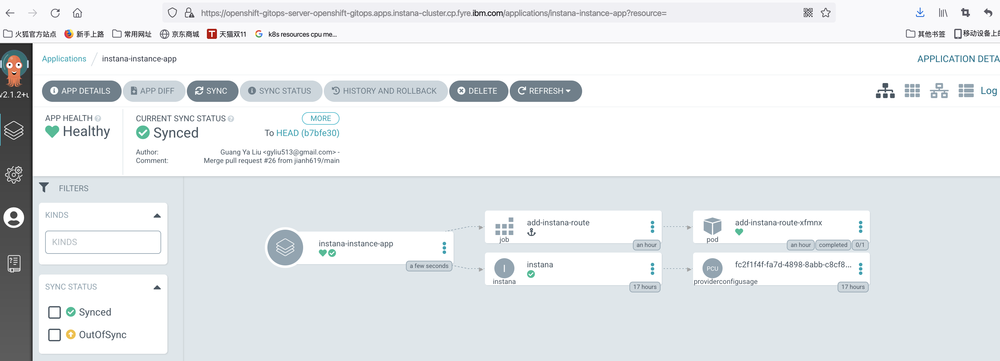

<!-- START doctoc generated TOC please keep comment here to allow auto update -->
<!-- DON'T EDIT THIS SECTION, INSTEAD RE-RUN doctoc TO UPDATE -->
**Table of Contents**  *generated with [DocToc](https://github.com/thlorenz/doctoc)*

- [Deploy Instana with OpenShift GitOps](#deploy-instana-with-openshift-gitops)
  - [Prerequisites](#prerequisites)
    - [Deploy Instana to Kubernetes Cluster](#deploy-instana-to-kubernetes-cluster)
    - [Deploy Instana to OpenShift Cluster](#deploy-instana-to-openshift-cluster)
  - [Install Infra (Crossplane and Crossplane Instana Provider)](#install-infra-crossplane-and-crossplane-instana-provider)
    - [Login to Argo CD](#login-to-argo-cd)
  - [Login to OpenShift and grant Argo CD enough permissions](#login-to-openshift-and-grant-argo-cd-enough-permissions)
    - [Install Crossplane Instana Provider](#install-crossplane-instana-provider)
    - [Verify Crossplane Provider](#verify-crossplane-provider)
      - [CLI Verify](#cli-verify)
      - [UI Verify](#ui-verify)
  - [Deploy Instana](#deploy-instana)
    - [Create secret for target k8s kubeconfig](#create-secret-for-target-k8s-kubeconfig)
    - [Create configmap for Instana settings](#create-configmap-for-instana-settings)
    - [Create Argo CD application for installing Instana](#create-argo-cd-application-for-installing-instana)
  - [Verify Instana Installation](#verify-instana-installation)
      - [CLI Verify](#cli-verify-1)
      - [UI Verify](#ui-verify-1)
  - [Access Instana UI](#access-instana-ui)

<!-- END doctoc generated TOC please keep comment here to allow auto update -->

# Deploy Instana with OpenShift GitOps

## Prerequisites

- OpenShift 4.6+
- Gitops Operator (Red Hat OpenShift GitOps) in OpenShift operator-hub
- Crossplane Operator (Upbound Universal Crossplane (UXP)) in OpenShift operator-hub
- Instana DB Host
  - With at least 16 Core, 64G Memory and 250G Disk
  - All DB container are ready and running on the DB Host

### Deploy Instana to Kubernetes Cluster
- Kubernetes Cluster
  - With at least 16 Core, 64G Memory and 250G Disk

### Deploy Instana to OpenShift Cluster
- OpenShift 4.6+
  - With at least 16 Core, 64G Memory and 250G Disk

## Install Infra (Crossplane and Crossplane Instana Provider)

### Login to Argo CD

   

```
Username: admin  
Password: Please copy the Data value of secret "openshift-gitops-cluster" in namespace "openshift-gitops"
```

 

## Login to OpenShift and grant Argo CD enough permissions

```yaml
kind: ClusterRoleBinding
apiVersion: rbac.authorization.k8s.io/v1
metadata:
  name: argocd-admin
subjects:
- kind: ServiceAccount
  name: openshift-gitops-argocd-application-controller
  namespace: openshift-gitops
roleRef:
  apiGroup: rbac.authorization.k8s.io
  kind: ClusterRole
  name: cluster-admin
```

### Install Crossplane Instana Provider

- Create application
- Choose `New App` in `Applications`
- Input parameters as follows, then `create`
  - GENERAL
    - Application Name: crossplane-provider-parent-app
    - Project: default
    - SYNC POLICY: Automatic
  - SOURCE
    - REPO URL: https://github.com/cloud-pak-gitops/instana-gitops
    - Revision: HEAD
    - Path: config/argocd-apps/infra
  - DESTINATION
    - Cluster URL: https://kubernetes.default.svc
    - Namespace: openshift-gitops
  - HELM
    - metadata.argocd_app_namespace: openshift-gitops
    - metadata.instana_provider_namespace: upbound-system
    - repoURL: https://github.com/cloud-pak-gitops/instana-gitops

### Verify Crossplane Provider

#### CLI Verify

After instana provider was deployed, you can run the command as follows to check:

```
kubectl get po -n upbound-system
kubectl get application -A
argocd app list
```

In this tutorial, the output of the above command is as follows:

```console
# kubectl get po -n upbound-system
NAME                                           READY   STATUS      RESTARTS   AGE
crossplane-77c7b9c944-727ks                    1/1     Running     0          7m18s
crossplane-provider-instana-6c578cd958-kmms9   1/1     Running     0          2m42s
crossplane-rbac-manager-75b6474449-hjb2f       1/1     Running     0          7m18s
scc-instana-job-qj5tb                          0/1     Completed   0          26s
upbound-bootstrapper-7b6b557848-x6jkx          1/1     Running     0          7m18s
xgql-5958d98cb5-v7bz2                          1/1     Running     2          7m18s
```
```console
# kubectl get application -A
NAMESPACE          NAME                             SYNC STATUS   HEALTH STATUS
openshift-gitops   crossplane-provider-app          Synced        Healthy
openshift-gitops   crossplane-provider-parent-app   Synced        Healthy
```
```console
# argocd app list
NAME                            CLUSTER                         NAMESPACE        PROJECT  STATUS  HEALTH   SYNCPOLICY  CONDITIONS  REPO                                        PATH                           TARGET
crossplane-provider-app         https://kubernetes.default.svc  upbound-system   default  Synced  Healthy  Auto-Prune  <none>      https://github.com/cloud-pak-gitops/instana-gitops  config/crossplane
crossplane-provider-parent-app  https://kubernetes.default.svc  openshift-giops  default  Synced  Healthy  <none>      <none>      https://github.com/cloud-pak-gitops/instana-gitops  config/argocd-apps/crossplane  HEAD
```

You can see Instana provider was running, and there is also a job pod named as `scc-instana-job-fm42r` which was used to detect if Instana was going to be deployed in Kubernetes or OpenShift Cluster.

#### UI Verify

From Argo CD UI, you will be able to see there are two applications as follows:

- There are two applications, one is `crossplane-provider-parent-app` and another is `crossplane-provider-app`. The `crossplane-provider-parent-app` bring up the `crossplane-provider-app` via the [app-of-apps pattern](https://argo-cd.readthedocs.io/en/stable/operator-manual/cluster-bootstrapping/#app-of-apps-pattern).


- This is the deatail of app `crossplane-provider-parent-app`, and the following picture describes the [app-of-apps pattern](https://argo-cd.readthedocs.io/en/stable/operator-manual/cluster-bootstrapping/#app-of-apps-pattern).


- The following picture is the detail of the `crossplane-provider-app`, you can see all of the resources for this app.


## Deploy Instana

### Create secret for target k8s kubeconfig

Using the `kubeconfig` in this repo as example:

```shell
kubectl create secret generic k8s-kubeconfig --from-file=credentials=<kubeconfig> -n crossplane-system
```

**Note:** please replace the `kubeconfig` to your real file , default value: /root/.kube/config

### Create configmap for Instana settings

```shell
kubectl create configmap instana-settings --from-file=<settings.hcl> -n crossplane-system
```

**Note:** please replace the `settings.hcl` to your real file address

### Create Argo CD application for installing Instana

Input parameters as follows when creating application:
- GENERAL
  - Application Name: instana-parent-app
  - Project: default
  - SYNC POLICY: Automatic
- SOURCE
  - REPO URL : https://github.com/cloud-pak-gitops/instana-gitops
  - Target version: HEAD
  - path: config/instana
- DESTINATION
  - Cluster URL: https://kubernetes.default.svc
  - Namespace: openshift-gitops
- HELM
  - Update based on your cluster configuration

## Verify Instana Installation

#### CLI Verify

After instana instance was deployed, you can run the command as follows to check:

```
kubectl get po -n crossplane-system
kubectl get application -A
kubectl get po -n instana-operator
kubectl get po -n instana-core
kubectl get po -n instana-units
```

In this tutorial, the output of the above command is as follows:

```console
# kubectl get pod -n crossplane-system
NAME                           READY   STATUS      RESTARTS   AGE
add-instana-route-xfmnx        0/1     Completed   0          5h25m
instana-k8s-kubeconfig-fksxc   0/1     Completed   0          5h25m
```
```console
# kubectl get application -A
NAMESPACE          NAME                             SYNC STATUS   HEALTH STATUS
openshift-gitops   crossplane-provider-app          Synced        Healthy
openshift-gitops   crossplane-provider-parent-app   Synced        Healthy
openshift-gitops   instana-instance-app             Synced        Healthy
openshift-gitops   instana-parent-app               Synced        Healthy
```

Wait a while and check if all pods under namespace `instana-operator`, `instana-core` and `instana-units` and are running well without any crash.

```console
# kubectl get po -n instana-operator
NAME                                           READY   STATUS    RESTARTS   AGE
instana-selfhosted-operator-54f6b5f8c5-42txx   1/1     Running   1          5h25m
```
```console
# kubectl get po -n instana-core
NAME                                         READY   STATUS    RESTARTS   AGE
acceptor-6764fc9f75-w7p9p                    1/1     Running   0          5h22m
accountant-55f7fcdcfc-djfj5                  1/1     Running   0          5h22m
appdata-health-processor-6dc9fcdcf-xp64z     1/1     Running   0          5h22m
appdata-live-aggregator-54d57b88c5-stkvt     1/1     Running   0          5h22m
appdata-reader-d4858cc45-ggtxl               1/1     Running   0          5h22m
appdata-writer-564fb5b4c7-jfhsr              1/1     Running   0          5h22m
butler-596855bfbb-5pf95                      1/1     Running   0          5h22m
cashier-ingest-5f8c79f9b-jbsk6               1/1     Running   0          5h22m
cashier-rollup-6766bf5749-7st2k              1/1     Running   0          5h22m
eum-acceptor-66c77b968b-lt65f                1/1     Running   0          5h22m
eum-health-processor-5ffdb949b7-2g9t5        1/1     Running   0          5h22m
eum-processor-9767f6bd8-ffg4w                1/1     Running   0          5h22m
groundskeeper-6b9489f5bf-cflv4               1/1     Running   0          5h22m
ingress-core-5b959bf89-2gfqn                 1/1     Running   0          5h22m
js-stack-trace-translator-867d89d8c5-5bnch   1/1     Running   0          5h22m
serverless-acceptor-66d94d6d59-5fv2k         1/1     Running   0          5h22m
sli-evaluator-5d54b7c64f-9smhk               1/1     Running   0          5h22m
```
```console
# kubectl get po -n instana-units
NAME                                                       READY   STATUS    RESTARTS   AGE
ingress-9c45c857c-rsqcs                                    1/1     Running   0          5h21m
tu-instana-prod-appdata-legacy-converter-dccb7696d-9thlk   1/1     Running   0          5h21m
tu-instana-prod-appdata-processor-79bf46f4ff-rqxdc         1/1     Running   0          5h21m
tu-instana-prod-filler-7cbdbb58d4-5p48s                    1/1     Running   0          5h21m
tu-instana-prod-issue-tracker-6759bc5985-gppj5             1/1     Running   0          5h21m
tu-instana-prod-processor-b458c5f9f-cf2v8                  1/1     Running   0          5h21m
tu-instana-prod-ui-backend-688fc96d98-p84p7                1/1     Running   0          5h21m
ui-client-d459dd987-rg4lx                                  1/1     Running   0          5h21m
```

#### UI Verify

From Argo CD UI, you will be able to see there are another two applications added as follows:

- There are two applications, one is `instana-parent-app` and another is `instana-instance-app`. The `instana-parent-app` bring up the `instana-instance-app` via the [app-of-apps pattern](https://argo-cd.readthedocs.io/en/stable/operator-manual/cluster-bootstrapping/#app-of-apps-pattern).


- This is the deatail of app `instana-parent-app`, and the following picture describes the [app-of-apps pattern](https://argo-cd.readthedocs.io/en/stable/operator-manual/cluster-bootstrapping/#app-of-apps-pattern).


- The following picture is the detail of the `instana-instance-app`, you can see all of the resources for this app.


## Access Instana UI

Check route to get the UI access url: 

```console
# kubectl get route -A | grep instana.apps
instana-core               acceptor-svc              agent.instana.apps.instana-cluster.cp.fyre.ibm.com                                     acceptor                  8600    passthrough/Redirect   None
instana-core               ingress-core-svc          instana.apps.instana-cluster.cp.fyre.ibm.com                                           ingress-core              8443    passthrough/Redirect   None
instana-units              unit-ingress-svc          prod-instana.instana.apps.instana-cluster.cp.fyre.ibm.com                              ingress                   8443    passthrough/Redirect   None
```

Login to the Instana UI via route `ingress-core-svc`, for example here is `instana.apps.instana-cluster.cp.fyre.ibm.com` in my cluster.

- `User name` is `admin@instana.local` by default
- `Passowrd` is `<settings.hcl-admin_password>`, here `password` is `passw0rd` for my cluster.


After click `Sign In`, you will be navigated to the Instan UI as follows.


