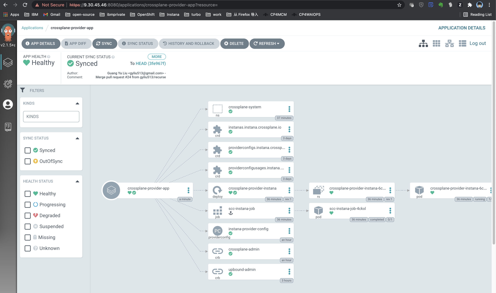

<!-- START doctoc generated TOC please keep comment here to allow auto update -->
<!-- DON'T EDIT THIS SECTION, INSTEAD RE-RUN doctoc TO UPDATE -->
**Table of Contents**  *generated with [DocToc](https://github.com/thlorenz/doctoc)*

- [Deploy Instana with OpenShift GitOps](#deploy-instana-with-openshift-gitops)
  - [Prerequisites](#prerequisites)
  - [Install Crossplane Instana Provider on OpenShift](#install-crossplane-instana-provider-on-openshift)
    - [Login to Argo CD](#login-to-argo-cd)
  - [Login to OpenShift and grant Argo CD enough permissions](#login-to-openshift-and-grant-argo-cd-enough-permissions)
    - [Install Crossplane Instana Provider](#install-crossplane-instana-provider)
    - [Verify Crossplane Provider](#verify-crossplane-provider)
      - [CLI Verify](#cli-verify)
      - [UI Verify](#ui-verify)
  - [Deploy Instana](#deploy-instana)
    - [Create secret for target k8s kubeconfig](#create-secret-for-target-k8s-kubeconfig)
    - [Create configmap for Instana settings](#create-configmap-for-instana-settings)
    - [Create Argo CD application for installing Instana](#create-argo-cd-application-for-installing-instana)
  - [Verify Instana Installation](#verify-instana-installation)

<!-- END doctoc generated TOC please keep comment here to allow auto update -->

# Deploy Instana with OpenShift GitOps

## Prerequisites

- OpenShift 4.6+
- Gitops Operator (Red Hat OpenShift GitOps) in OpenShift operator-hub
- Crossplane Operator (Upbound Universal Crossplane (UXP)) in OpenShift operator-hub

## Install Crossplane Instana Provider on OpenShift

### Login to Argo CD

   

```
Username: admin  
Password: Please copy the Data value of secret "openshift-gitops-cluster" in namespace "openshift-gitops"
```

 

## Login to OpenShift and grant Argo CD enough permissions

```yaml
kind: ClusterRoleBinding
apiVersion: rbac.authorization.k8s.io/v1
metadata:
  name: argocd-admin
subjects:
- kind: ServiceAccount
  name: openshift-gitops-argocd-application-controller
  namespace: openshift-gitops
roleRef:
  apiGroup: rbac.authorization.k8s.io
  kind: ClusterRole
  name: cluster-admin
```

### Install Crossplane Instana Provider

- Create application
- Choose `New App` in `Applications`
- Input parameters as follows, then `create`
  - GENERAL
    - Application Name: crossplane-provider-parent-app
    - Project: default
    - SYNC POLICY: Automatic
  - SOURCE
    - REPO URL: https://github.com/cloud-pak-gitops/instana-gitops
    - Revision: HEAD
    - Path: config/argocd-apps/crossplane
  - DESTINATION
    - Cluster URL: https://kubernetes.default.svc
    - Namespace: openshift-gitops
  - HELM
    - metadata.argocd_app_namespace: openshift-gitops
    - metadata.instana_provider_namespace: upbound-system
    - repoURL: https://github.com/cloud-pak-gitops/instana-gitops

### Verify Crossplane Provider

#### CLI Verify

After instana provider was deployed, you can run the command as follows to check:

```
kubectl get po -n upbound-system
kubectl get application -A
argocd app list
```

In this tutorial, the output of the above command is as follows:

```console
# kubectl get po -n upbound-system
NAME                                           READY   STATUS      RESTARTS   AGE
crossplane-77c7b9c944-727ks                    1/1     Running     0          7m18s
crossplane-provider-instana-6c578cd958-kmms9   1/1     Running     0          2m42s
crossplane-rbac-manager-75b6474449-hjb2f       1/1     Running     0          7m18s
scc-instana-job-qj5tb                          0/1     Completed   0          26s
upbound-bootstrapper-7b6b557848-x6jkx          1/1     Running     0          7m18s
xgql-5958d98cb5-v7bz2                          1/1     Running     2          7m18s
```
```console
# kubectl get application -A
NAMESPACE          NAME                             SYNC STATUS   HEALTH STATUS
openshift-gitops   crossplane-provider-app          Synced        Healthy
openshift-gitops   crossplane-provider-parent-app   Synced        Healthy
```
```console
# argocd app list
NAME                            CLUSTER                         NAMESPACE        PROJECT  STATUS  HEALTH   SYNCPOLICY  CONDITIONS  REPO                                        PATH                           TARGET
crossplane-provider-app         https://kubernetes.default.svc  upbound-system   default  Synced  Healthy  Auto-Prune  <none>      https://github.com/cloud-pak-gitops/instana-gitops  config/crossplane
crossplane-provider-parent-app  https://kubernetes.default.svc  openshift-giops  default  Synced  Healthy  <none>      <none>      https://github.com/cloud-pak-gitops/instana-gitops  config/argocd-apps/crossplane  HEAD
```

You can see Instana provider was running, and there is also a job pod named as `scc-instana-job-fm42r` which was used to detect if Instana was going to be deployed in Kubernetes or OpenShift Cluster.

#### UI Verify

From Argo CD UI, you will be able to see there are two applications as follows:

- There are two applications, one is `crossplane-provider-parent-app` and another is `crossplane-provider-app`. The `crossplane-provider-parent-app` bring up the `crossplane-provider-app` via the [app-of-apps pattern](https://argo-cd.readthedocs.io/en/stable/operator-manual/cluster-bootstrapping/#app-of-apps-pattern).


- This is the deatail of app `crossplane-provider-parent-app`, and the following picture describes the [app-of-apps pattern](https://argo-cd.readthedocs.io/en/stable/operator-manual/cluster-bootstrapping/#app-of-apps-pattern).


- The following picture is the detail of the `crossplane-provider-app`, you can see all of the resources for this app.


## Deploy Instana

### Create secret for target k8s kubeconfig

Using the `kubeconfig` in this repo as example:

```shell
kubectl create secret generic k8s-kubeconfig --from-file=credentials=<kubeconfig> -n crossplane-system
```

**Note:** please replace the `kubeconfig` to your real file , default value: /root/.kube/config

### Create configmap for Instana settings

```shell
kubectl create configmap instana-settings --from-file=<settings.hcl> -n crossplane-system
```

**Note:** please replace the `settings.hcl` to your real file address

### Create Argo CD application for installing Instana

Input parameters as follows when creating application:
- GENERAL
  - Application Name: instana-parent-app
  - Project: default
  - SYNC POLICY: Automatic
- SOURCE
  - REPO URL : https://github.com/cloud-pak-gitops/instana-gitops
  - Target version: HEAD
  - path: config/argocd-apps/instana
- DESTINATION
  - Cluster URL: https://kubernetes.default.svc
  - Namespace: openshift-gitops
  - HELM
    - metadata.argocd_app_namespace: openshift-gitops
    - metadata.instana_namespace: crossplane-system
    - repoURL: https://github.com/cloud-pak-gitops/instana-gitops

## Verify Instana Installation

TODO