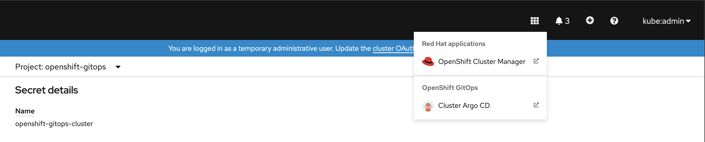
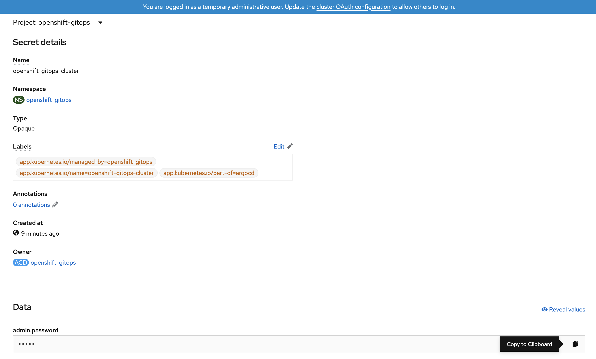
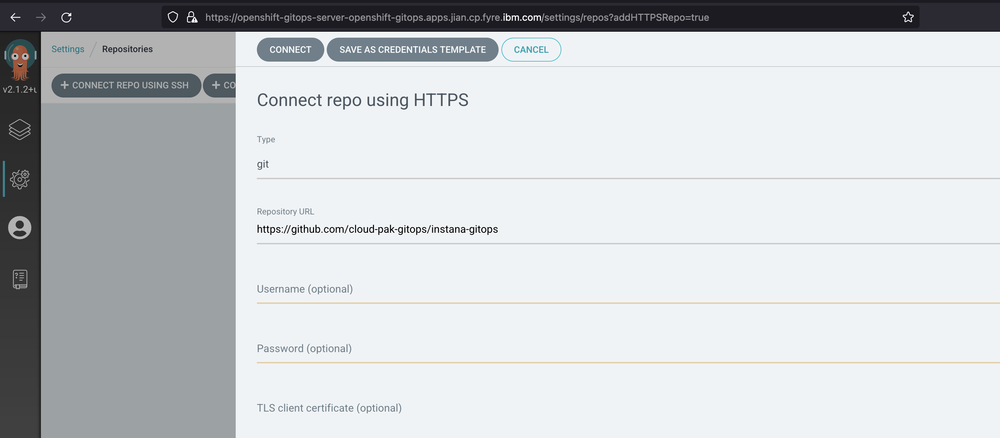

<!-- START doctoc generated TOC please keep comment here to allow auto update -->
<!-- DON'T EDIT THIS SECTION, INSTEAD RE-RUN doctoc TO UPDATE -->
**Table of Contents**  *generated with [DocToc](https://github.com/thlorenz/doctoc)*

- [Deploy Instana with crossplane](#deploy-instana-with-crossplane)
  - [Prerequisite](#prerequisite)
    - [Platform Requirements](#platform-requirements)
    - [Config Gitops and Crossplane Provider on OCP](#config-gitops-and-crossplane-provider-on-ocp)
  - [Deploy Instana](#deploy-instana)
    - [Create a secret storing target k8s kubeconfig](#create-a-secret-storing-target-k8s-kubeconfig)
    - [Create a configmap storing the instana settings](#create-a-configmap-storing-the-instana-settings)
    - [Create a ArgoCD application for installing instana](#create-a-argocd-application-for-installing-instana)

<!-- END doctoc generated TOC please keep comment here to allow auto update -->

# Deploy Instana with crossplane

## Prerequisite

### Platform Requirements

- OCP 4.6 + 
- Install gitops operator(Red Hat OpenShift GitOps) in ocp operator-hub
- Install crossplane operator(Upbound Universal Crossplane (UXP)) in ocp operator-hub

### Config Gitops and Crossplane Provider on OCP

**Login to openshift and grant argocd enough permissions**

```yaml
kind: ClusterRoleBinding
apiVersion: rbac.authorization.k8s.io/v1
metadata:
  name: argocd-admin
subjects:
  - kind: ServiceAccount
    name: openshift-gitops-argocd-application-controller
    namespace: openshift-gitops
roleRef:
  apiGroup: rbac.authorization.k8s.io
  kind: ClusterRole
  name: cluster-admin
```

**Login to ArgoCD**


Login ArgoCD entrance
   

Login ArgoCD Username/Password
```
Username: admin  
Password: Please copy the Data value of secret "openshift-gitops-cluster" in namespace "openshift-gitops"
```
 

**Install Crossplane Provider**
Connect git repo   
Choose "Repositories" in "settings", then choose connect way, such as "Connect repo using HTTPS".  
Fill in like below, then choose "connect".     
```
Type: git
Repository URL: REPO URL value
Usename: Git username
Password: Git token
```
   
Create application.  
Choose "New App" in "Applications".  
Fill in like below, then choose "create". 

```
GENERAL
Application Name: crossplane
Project: default
SYNC POLICY: Automatic

SOURCE
REPO URL : https://github.com/cloud-pak-gitops/instana-gitops
Target version: HEAD
path: instana-automatic/crossplane

DESTINATION
Cluster URL: https://kubernetes.default.svc
Namespace: upbound-system
DIRECTORY
DIRECTORY RECURSE: tick it
```

## Deploy Instana

### Create a secret storing target k8s kubeconfig

Using the kubeconfig in this repo as example :

```shell
kubectl create secret generic k8s-kubeconfig --from-file=credentials=<kubeconfig> -n crossplane-system
```

**Note:** please replace the `kubeconfig` to your real file , default value : /root/.kube/config

### Create a configmap storing the instana settings 

```shell
kubectl create configmap instana-settings --from-file=<settings.hcl> -n crossplane-system
```

**Note:** please replace the `settings.hcl` to your real file address


### Create a ArgoCD application for installing instana

```

GENERAL
Application Name: instana
Project: default
SYNC POLICY: Automatic

SOURCE
REPO URL : https://github.com/cloud-pak-gitops/instana-gitops
Target version: HEAD
path: instana-automatic/instana

DESTINATION
Cluster URL: https://kubernetes.default.svc
Namespace: upbound-system
DIRECTORY
DIRECTORY RECURSE: tick it
```
